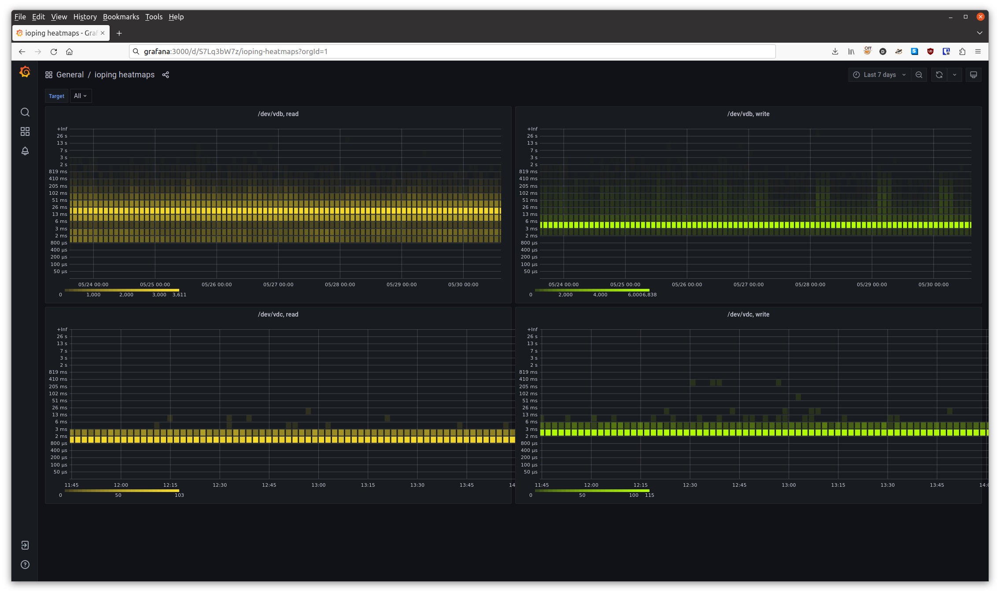

# ioping_prober
Prometheus style "ioping" prober.



## Overview

This prober uses `ioping` command to run probes against a local file, directory or device and records the responses in Prometheus histogram metrics.

This project is used in production by Catalyst Cloud to monitor Ceph block storage from a *customer viewpoint* (in addition to internal Ceph exporters).
It provides a valuable insight into the real world performance being experienced by users of each disk tier, both historical and during incidents.

Code initially forked from https://github.com/SuperQ/smokeping_prober/

```
usage: ioping_prober [<flags>] <target>...


Flags:
  -h, --[no-]help                Show context-sensitive help (also try --help-long and --help-man).
      --web.telemetry-path="/metrics"  
                                 Path under which to expose metrics.
      --[no-]web.systemd-socket  Use systemd socket activation listeners instead of port listeners (Linux only).
      --web.listen-address=:10033 ...
                                 Addresses on which to expose metrics and web interface. Repeatable for multiple addresses. Examples: `:9100` or `[::1]:9100` for http, `vsock://:9100` for vsock
      --web.config.file=""       Path to configuration file that can enable TLS or authentication. See: https://github.com/prometheus/exporter-toolkit/blob/master/docs/web-configuration.md
      --buckets="5e-05,0.0001,0.0002,0.0004,0.0008,0.0016,0.0032,0.0064,0.0128,0.0256,0.0512,0.1024,0.2048,0.4096,0.8192,1.6384,3.2768,6.5536,13.1072,26.2144"  
                                 A comma delimited list of buckets to use
  -i, --ping.interval=1s         Ping interval duration
      --[no-]write               Write to target. Uses ioping -W and is safe for directory target.
      --[no-]unsafewrite         Unsafely write to target. Uses ioping -WWW and is destructive to file|device- read ioping manpage.
      --log.level=info           Only log messages with the given severity or above. One of: [debug, info, warn, error]
      --log.format=logfmt        Output format of log messages. One of: [logfmt, json]
      --[no-]version             Show application version.

Args:
  <target>  List of target directory/file/device to ioping
```

## Requirements

`ioping` command is required on the local machine. This was tested against version `ioping 1.2.16.gf549dff`

Ubuntu 24.04 now includes ioping 1.3 which includes the flag `-warmup 0` used by this exporter.

## Building and running

Requires Go >= 1.22

```console
go get github.com/dalees/ioping_prober
```

Running the exporter is best suited for a VM with dedicated disks attached. Do not use `--unsafewrite` without using volumes that are dedicated to this test. In the example we have attached two ceph volumes, one spinning rust and one nvme. The differences can be seen on the example graph.

Start exporter with safe writes to `/tmp`.
```
./ioping_prober --ping.interval=1s --log.level=debug /tmp --write
```

Starts exporter with UNSAFE WRITES. USE ONLY ON EMPTY DISKS.
```
./ioping_prober --ping.interval=1s --log.level=debug /dev/vdb /dev/vdc --unsafewrite
```

## Container build and usage

A Dockerfile is provided that builds and includes an up to date ioping version.

To build:
```
docker build . -t ioping_prober
```

Basic usage:
```
docker run -d -p 10033:10033 --name ioping_prober ioping_prober --write /tmp

curl http://localhost:10033/metrics
```

## Metrics Exported

With the exporter running, Prometheus can be configured to [scrape the exporter target](example-scrapeconfig.yml) and ingest the current metrics.


 Metric Name                            | Type       | Description
----------------------------------------|------------|-------------------------------------------
 ioping\_measurements\_total            | Counter    | Counter of iopings made.
 ioping\_measurement\_duration\_seconds | Histogram  | Filesystem response duration.

An example in Prometheus exposition format is available in [example-metrics.txt](example-metrics.txt).

## Grafana Dashboard

A Grafana dashboard is available in [example-dashboard.json](example-dashboard.json) that presents the above metrics in a heatmap.
